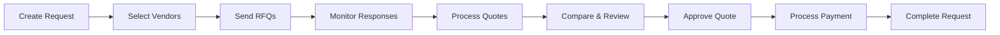
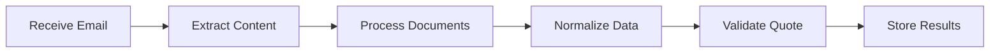

# SupplyGraph MVP

**Intelligent Procurement Automation Platform**

SupplyGraph automates the complete procure-to-pay workflow using LangGraph AI orchestration, from purchase requests to vendor quotes, comparison, approval, and payment execution.

## 🏗️ Architecture

```
┌─────────────────────────────────────────────────────────────────┐
│                        SupplyGraph MVP                          │
├─────────────────────────────────────────────────────────────────┤
│  Frontend (Next.js)          │  AI Service (FastAPI + LangGraph) │
│  ├─ Authentication           │  ├─ Procurement Workflows         │
│  ├─ Multi-tenant UI          │  ├─ Quote Processing             │
│  ├─ Vendor Management        │  ├─ Email Integration            │
│  ├─ Quote Comparison         │  ├─ Document Processing          │
│  └─ Approval Workflows       │  └─ Payment Orchestration        │
├─────────────────────────────────────────────────────────────────┤
│                    Shared Database Layer                        │
│  ├─ PostgreSQL + RLS (Multi-tenant)                           │
│  ├─ Prisma ORM (TypeScript + Python)                          │
│  └─ Redis/Valkey (Caching + Queues)                           │
└─────────────────────────────────────────────────────────────────┘
```

## 🚀 Quick Start

### Prerequisites

- **Node.js 18+** with `pnpm`
- **Python 3.11+** with `uv`
- **PostgreSQL 15+**
- **Redis/Valkey**
- **Ollama** (for local LLM) or OpenAI API key

### 1. Clone and Setup

```bash
git clone <repository>
cd supplygraph

# Install shared database package
cd packages/db
pnpm install

# Setup database schema
cp .env.example .env
# Edit .env with your database credentials
pnpm db:generate
pnpm db:push
pnpm db:seed
```

### 2. Start AI Service

```bash
cd apps/ai-service
uv sync
cp .env.example .env
# Edit .env with your configuration

# Start the service
uv run uvicorn src.main:app --reload --port 8000
```

### 3. Start Frontend

```bash
cd apps/web
pnpm install
cp .env.example .env.local
# Edit .env.local with your configuration

# Start development server
pnpm dev
```

### 4. Access the Application

- **Frontend**: http://localhost:3000
- **AI Service API**: http://localhost:8000
- **API Docs**: http://localhost:8000/docs

## 📋 Project Structure

```
supplygraph/
├── packages/
│   └── db/                    # Shared Prisma schema + client
│       ├── schema.prisma      # Canonical database schema
│       ├── package.json       # TypeScript client config
│       └── seed.ts           # Database seeding
│
├── apps/
│   ├── web/                  # Next.js frontend + BFF
│   │   ├── app/             # App Router pages
│   │   ├── components/      # React components
│   │   ├── lib/            # Utilities and configs
│   │   └── package.json    # Frontend dependencies
│   │
│   └── ai-service/          # FastAPI + LangGraph backend
│       ├── src/
│       │   ├── workflows/   # LangGraph workflow definitions
│       │   ├── services/    # Business logic services
│       │   ├── routers/     # FastAPI route handlers
│       │   └── main.py     # Application entry point
│       ├── tests/          # Test suite
│       └── pyproject.toml  # Python dependencies
│
├── docker-compose.yml       # Local development services
├── README.md               # This file
└── prd.md                 # Product Requirements Document
```

## 🔄 Workflows

### Procurement Lifecycle



**LangGraph States**: `CREATED → QUOTES_REQUESTED → QUOTES_RECEIVED → APPROVED → PAID → COMPLETED`

### Quote Processing



**AI-Powered**: Uses Docling + LLM for intelligent document processing and data extraction.

## 🛠️ Technology Stack

### Frontend (Next.js)
- **Framework**: Next.js 15 with App Router
- **Auth**: Better Auth with Google OAuth
- **UI**: shadcn/ui + Tailwind CSS
- **State**: TanStack Query + Zustand
- **Database**: Prisma Client (TypeScript)

### AI Service (Python)
- **Framework**: FastAPI with async support
- **Workflows**: LangGraph for state management
- **AI**: LangChain + OpenAI/Ollama
- **Documents**: Docling for PDF/document processing
- **Database**: Prisma Client Python
- **Queue**: Celery + Redis/Valkey

### Shared Infrastructure
- **Database**: PostgreSQL with Row-Level Security
- **ORM**: Prisma (multi-language support)
- **Cache**: Redis/Valkey
- **Email**: Gmail API integration
- **Payments**: Stripe (test mode)

## 🔐 Multi-Tenant Security

### Row-Level Security (RLS)
Every database table includes `orgId` with PostgreSQL RLS policies:

```sql
CREATE POLICY tenant_isolation ON procurement_requests 
FOR ALL TO authenticated 
USING (org_id = current_setting('app.current_tenant')::text);
```

### Authentication Flow
1. User signs in via Better Auth (Google OAuth)
2. Organization context established
3. All API calls include `X-Tenant-ID` header
4. Database queries automatically scoped to tenant

## 📊 Key Features

### ✅ Implemented (MVP)
- [x] Multi-tenant authentication (Better Auth)
- [x] Procurement request creation
- [x] Vendor management
- [x] LangGraph workflow orchestration
- [x] Email integration (Gmail API)
- [x] Document processing (Docling + LLM)
- [x] Quote extraction and normalization
- [x] Quote comparison interface
- [x] Approval workflows
- [x] Payment integration (Stripe)
- [x] Audit logging
- [x] Row-level security (RLS)

### 🚧 In Progress
- [ ] Real-time notifications
- [ ] Advanced vendor selection algorithms
- [ ] Mobile-responsive UI
- [ ] Comprehensive test coverage
- [ ] Performance optimization

### 📋 Planned
- [ ] ERP integrations
- [ ] Advanced analytics dashboard
- [ ] Vendor performance scoring
- [ ] Bulk operations
- [ ] Mobile app
- [ ] Marketplace vendor discovery

## 🧪 Testing

### AI Service Tests
```bash
cd apps/ai-service
uv run pytest --cov=src
```

### Frontend Tests
```bash
cd apps/web
pnpm test
```

### Integration Tests
```bash
# Start test databases
docker run -d --name test-postgres -e POSTGRES_DB=supplygraph_test -p 5433:5432 postgres:16-alpine
docker run -d --name test-redis -p 6380:6379 redis:7-alpine

# Run full test suite
pnpm test:integration
```

## 🚀 Deployment

### Development
```bash
# Start all services
docker-compose up -d postgres redis ollama

# Start applications
pnpm dev:all
```

### Production
- **Frontend**: Vercel/Netlify
- **AI Service**: Railway/Render/AWS
- **Database**: Supabase/PlanetScale/AWS RDS
- **Cache**: Upstash Redis/AWS ElastiCache

## 📈 Monitoring & Observability

### Structured Logging
All services use structured JSON logging:

```json
{
  "timestamp": "2024-01-15T10:30:00Z",
  "level": "INFO",
  "service": "ai-service",
  "workflow": "procurement",
  "org_id": "org_123",
  "message": "Workflow completed successfully"
}
```

### Health Checks
- `/health/` - Basic health
- `/health/ready` - Readiness probe
- `/health/live` - Liveness probe

### Metrics
- Workflow execution times
- Quote processing accuracy
- Email processing volume
- User engagement metrics

## 🤝 Contributing

### Development Workflow
1. **Red**: Write failing tests first (TDD)
2. **Green**: Implement minimal code to pass
3. **Refactor**: Improve while keeping tests green
4. **Repeat**: Continue for each feature

### Code Standards
- **TypeScript**: Strict mode, proper typing
- **Python**: Type hints, async/await patterns
- **Testing**: >80% coverage target
- **Documentation**: Inline comments + README updates

## 📚 Documentation

- [Product Requirements Document](./prd.md)
- [AI Service Documentation](./apps/ai-service/README.md)
- [Database Schema](./packages/db/schema.prisma)
- [API Documentation](http://localhost:8000/docs) (when running)

## 🆘 Troubleshooting

### Common Issues

1. **Database Connection Errors**
   ```bash
   # Check PostgreSQL is running
   docker ps | grep postgres
   
   # Verify connection string
   psql $DATABASE_URL
   ```

2. **Prisma Client Issues**
   ```bash
   # Regenerate client
   cd packages/db
   pnpm db:generate
   ```

3. **LLM/Ollama Errors**
   ```bash
   # Check Ollama is running
   curl http://localhost:11434/api/tags
   
   # Pull required model
   ollama pull llama3.2
   ```

4. **Gmail API Issues**
   - Verify OAuth credentials in Google Console
   - Check redirect URIs match configuration
   - Ensure Gmail API is enabled

### Debug Mode
```bash
# Enable debug logging
export LOG_LEVEL=DEBUG

# Run with detailed output
pnpm dev:debug
```

## 📄 License

MIT License - see [LICENSE](./LICENSE) for details.

## 🙋‍♂️ Support

- **Issues**: GitHub Issues
- **Discussions**: GitHub Discussions
- **Email**: support@supplygraph.com

---

**Built with ❤️ using Next.js, FastAPI, LangGraph, and Prisma**